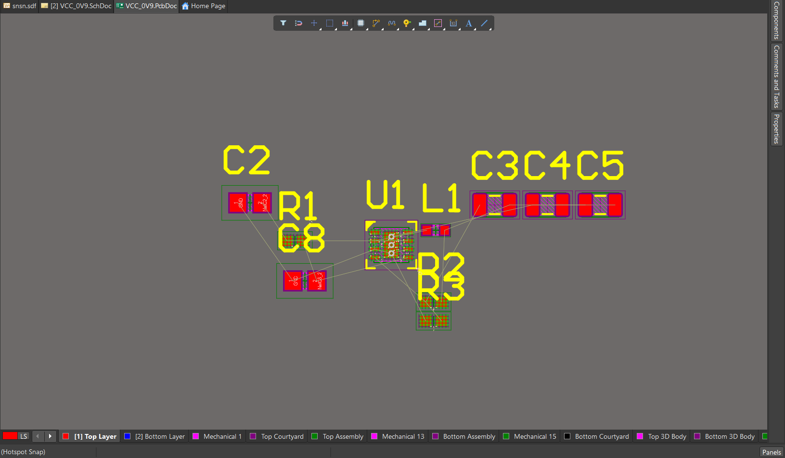
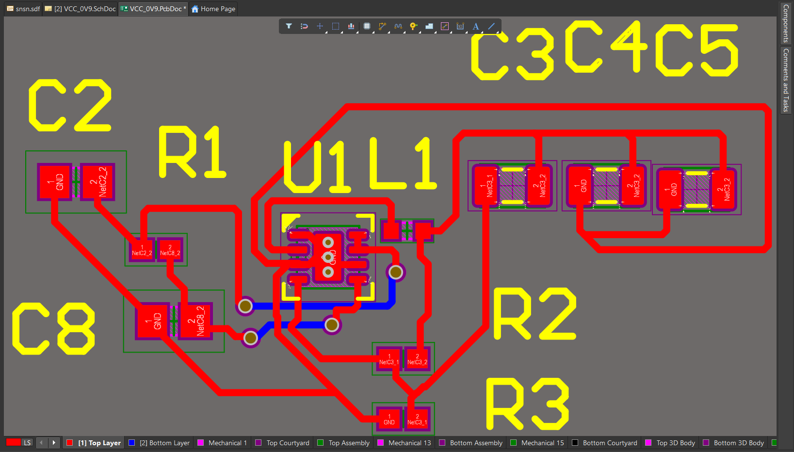
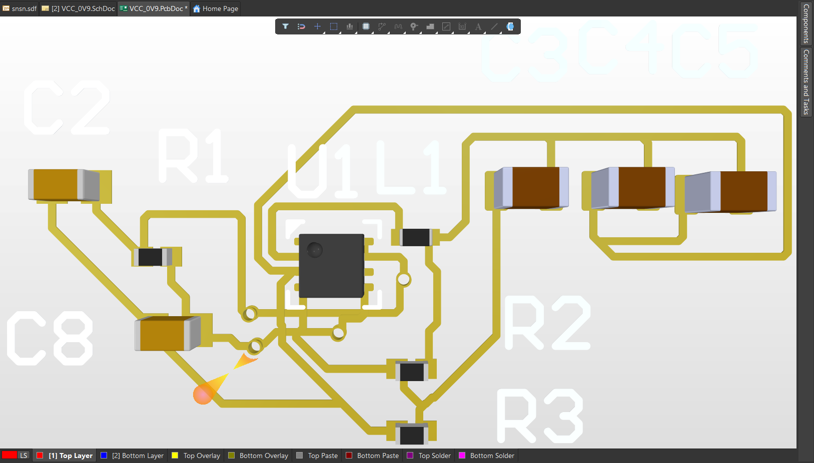
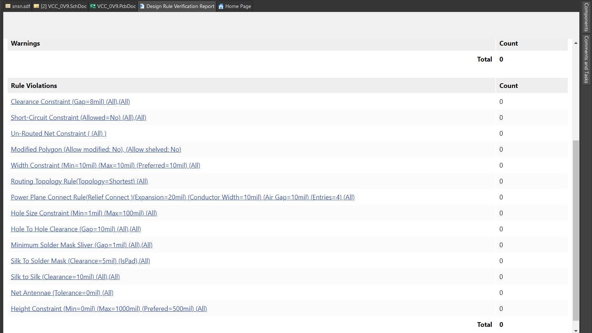

# TPS62060 Buck Converter PCB Design

## Overview

This project is a 0.9V buck converter PCB designed in Altium Designer using the TPS62060 switching regulator.

The design converts a higher input voltage to a regulated 0.9V output while maintaining efficient power conversion and compact PCB layout.

## Design Features

- TPS62060 step-down converter
- 0.9V regulated output
- 2-layer PCB design
- Altium Designer implementation
- Design Rule Check (DRC) clean
- Compact component placement
- Power routing and ground return optimization

## Tools Used

- Altium Designer
- TPS62060 Datasheet
- PCB Design Rules Verification

## Project Files

- TPS62060_Buck_Converter.zip (complete project files)
- layout_top.png
- placement_view.png
- layout_3d.png
- drc_report.png

## Placement View

## Top Layer Routing

## 3D View

## DRC Verification

## Author

Mark Lopez  
M.S. Electrical Engineering
